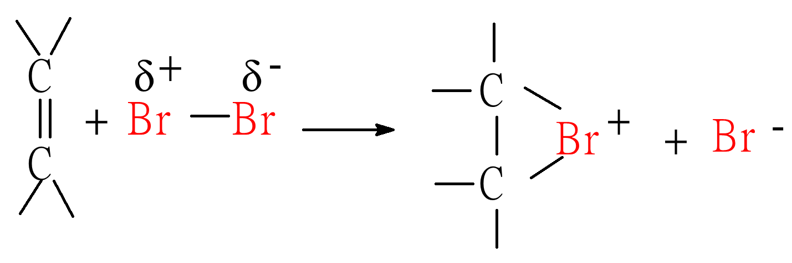

# 命名
1. 选择最长碳链为主链，根据主链是否含双键确定母体是烯烃或烷烃。（优先考虑含双键的最长碳链）
2. 主链为烯烃时，从**靠近双键一端**开始编号
3. 取代基位次、数目、名称写前，并**标出双键的位置**（用两个碳中位次小的，位次写在“烯”前）
4. 烯烃主链碳数大于10个时，在“烯”前加一个“碳”字

5. 常见烯烃基

# 异构现象
**碳数相同，烯烃异构体比烷烃多。**
1. **碳链**异构(构造异构)

2. **位置**异构(构造异构)

3. 顺反异构(-构型异构-立体异构)
    1. **产生顺反异构的条件**
       - 分子中具有**不能旋转的结构**，如**双键**、**脂环**等。
       - 不能旋转的**碳原子**必须**连有两个不同基团**。
    2. **顺反异构的命名**
       -  **相同基团**在$\pi$键平面的**同侧**为**顺式**。
       -  **相同基团**$\pi$键平面的**异侧**为**反式**。
    
4. 对于顺反异构无法解决的问题，采用**Z**、**E**命名法。(**Z**usammen, 一起；**E**ntgegen,相反)

    - **优先基团**在$\pi$键平面的**同侧**为**Z**-构型
    - **优先基团**在$\pi$键平面的**异侧**为**E**-构型
5. 优先次序规则
    1. 比较双键**C**原子**直接连接的原子**的**原子序数**，原子序数**大者优先**
    
    2. 若直接连接的原子的原子序数相同，则继续**延伸**比较，发现不同即停止；只比较**单个原子**
    
    3.  **双键或三键**视为与**同一个原子**连接**二次或三次**
    
    4. **将下列基团按优先次序排列大小：**
    

# 电子效应
## 诱导效应 （inductive effect）
1. 诱导效应：分子中原子或基团间相互影响，使共用电子对发生偏移。
2. 诱导效应的特点：**传递性**，**方向性**，**近程性**。
3. **以氢原子电负性作为参考标准**
    - **吸**电子基———**电负性大于氢**的原子或基团
    - **给**电子基———**电负性小于氢**的原子或基团
4.  吸电子能力的顺序：

## **共轭效应  conjugative effect**
>电子从局部扩展到更大的范围称作电子的**离域**。
**离域**的结果：**电子云密度平均化**。

1. **主要原因**：分子内的**共轭体系**和**共轭效应**。
2. **共轭效应**：分子内原子之间相互影响，引起**电子云密度的平均化**的效应。（电子离域）
3. 发生在两个$\pi$键之间的共轭叫 **$\pi\sim\pi$共轭** 。
4. **共轭条件**：
   - 共轭的原子在**同一平面**
   - 必须有**p轨道**和一定数量p电子
   - 共轭的p轨道必须属于**相邻的原子**
5. **常见共轭形式**
   1. **$\pi\sim\pi$共轭**，苯环电子流向醛基。
   
   2. O为$sp^2$杂化，共轭形式为 **$p\sim\pi$共轭**，O上p电子流向苯环。
   
   3. **$σ-π$超共轭**: 由 **$α-$碳氢**$σ$键与$π$键，  重叠形成，称为$σ-π$超共轭体系。
   
      - $α-$氢原子越多$σ-π$超共轭效应就越强。
      - **重叠程度稍差，共轭效应弱于$\pi\sim\pi$共轭，$p\sim\pi$共轭**
   4. **$σ-P$超共轭**: 由 **$σ$键** 与 **$P$轨道** 重叠形成共轭体系。
   
      - 烷基$α-$氢原子越多，$σ-p$ 超共轭效应就越强
      - 重叠程度稍差，共轭效应弱于$p\sim\pi$
      - 自由基的稳定性：
        

## 诱导效应与共轭效应比较

# 化学性质
## 加成反应

1. 催化加氢

2. 亲电加成反应（electrophilic addition reaction） 

    - **定义**：亲电试剂进攻烯烃的双键而进行的加成反应
    1. 卤素加成
        - 卤素的加成活性由大到小的顺序为：$\ce{Cl2}>\ce{Br2}>\ce{I2} $
        - **反应历程**：实验证明加成反应是分**两步**进行
            1. **第一步**：烯烃$\pi$电子效应使$\ce{Br2}$分子中$σ$键发生极化、异裂
            
            溴正离子与双键碳原子形成**三元环溴鎓离子中间体**
            2. **第二步**：溴负离子从背面进攻溴鎓离子,形成**反式加成产物**
            
    2. 加卤化氢
    
        - **Markovnikov**加成规律：马氏规则**氢**总是加在**含氢较多**的碳原子上
        - 亲电试剂$\ce{H+}$加在双键上，首先生成**碳正离子**
        
        - 在判断碳正离子的稳定性
    3. 不对称环烷烃的亲电加成
    
    4. 加硫酸
    
    5. 加水（直接水合法）
    
        - 在**酸催化**下,烯烃与**水**加成生成醇，是制备醇的方法之一，不对称烯烃加成**符合马氏规则**
        - 生成伯醇：硼氢化-**氧化反应**
    6. 加次卤酸
    
    说明： 先生成**卤鎓离子**中间体, 然后 **$\ce{OH-}$** 从背面进攻

## 氧化反应
1. 与$\ce{KMnO4}$作用

    - **碱性或中性$\ce{KMnO4}$** 氧化，产物为 **二元醇和$\ce{MnO2}$**
    - **酸性$\ce{KMnO4}$** 氧化，双键打开，产物为**羧酸**
    - **现象： $\ce{KMnO4}$褪色**
    - 在酸性$\ce{KMnO4}$中双键断裂三种形式
    
2. 臭氧氧化反应

    - 生成**醛或酮**。(不生成酸)
    - 烯烃结构不同产物不同
    

## 聚合反应（简称加聚反应）

小分子被称为 “**单体**”；大分子产物称为“**聚合物**”
- PE：聚乙烯
- PVC：聚氯乙烯

## α－氢原子的反应

受**双键影响**比较活泼，高温或**光照**下，烯烃α－氢原子被卤原子取代。（**自由基机理**）（多种取代产物）

# 二烯烃（dienes）
## 二烯烃的分类

1. 累积二烯烃

2. 隔离二烯烃
$\ce{CH2=CH - CH=CH2}$

3. 共轭二烯烃 （conjugated dienes）
$\ce{CH2=CH - CH=CH2}$
说明：双键C原子不都是$SP^2$杂化。

## 二烯烃的命名
主链的编号遵循**使两个双键编号尽可能小**的原则，但有选择时编号由 **Z 端**开始。 

$(2Z, 4E)-3-$甲基庚$-2,4-$二烯

$(2Z,5E)$ - 庚 $-2,5$ - 二烯
## 共轭二烯的性质
### 加成反应

- 80 °C 1,2加成
- 40 °C 1,4加成

### Diels-Alder 反应：

# 炔烃  alkyne
## 乙炔结构
$$\ce{CH#CH}$$

## 炔烃特点
1. **sp**杂化
2. 三键，1个σ键和2个$\pi$键
3. 几何图形为**直线**，键角180°
4. 异构体较烯烃少
5. 亲电加成性质不如烯烃活泼
6. 弱酸性
7. **杂化轨道中S成分多**
## 炔烃命名
1. 和烯烃类似。
2. 若主链同时含有双键和三键，则从靠近双键或三键一端开始编号。
3. 若双键和三键等距，则从双键一端编号。
4. 命名**烯前炔后**。
5. 标出双键和三键的位置。

$$\ce{CH3 - CH2CH=CH - CH2 - C#CH}\\庚-4-烯-1-炔 $$

## 炔烃性质
1. 加成反应

   - 遵守马氏规则
   - 加成需催化剂，**活性比烯烃小**
2. 亲电加成性质不如烯烃活泼 

3. 与水加成

说明：首先生成**烯醇**，后**烯醇重排**生成**醛**或**酮**。
4. 氧化反应
$\ce{KMnO4}$褪色，鉴别炔烃
5. 炔淦的生成（金属炔化物）

利用炔淦的生成鉴别三键在一端的炔烃。