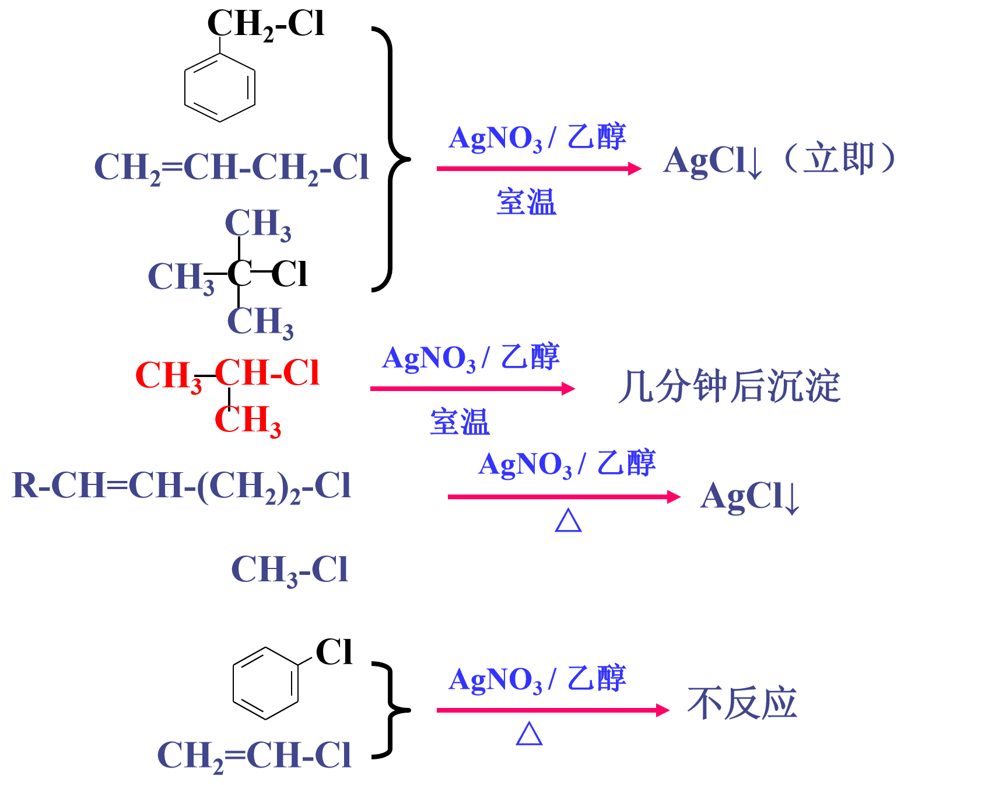
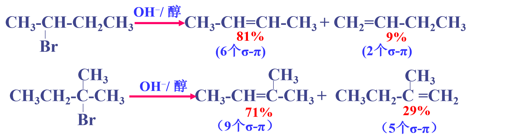

# 卤代烃
## 命名
- 与相应不饱和烃的命名原则相同。如主链含有不饱和键，从靠近不饱和键一端开始编号
## 亲核取代
1. 被羟基取代（水解反应）

2. 被烷氧基取代

3. 被氰基取代

4. 被氨基取代

### 亲核取代反应机制
1. 双分子历程（SN2）
   - 反应速率与亲核试剂和底物浓度有关
   - 亲核试剂从溴背后进攻
   - HO-C键的形成和C-Br断裂同时进行
   - 空间位阻不利于SN2
   - 产物**构型完全转化**
2. 单分子历程（SN1）
    - 反应速率与底物浓度有关
    - 反应分二步进行
    - C-Br断裂形成碳正离子，亲核试剂再进攻碳正离子
    - C+的稳定有利于SN1（分子重排）
    - 空间位阻不影响SN1
    - 产物**构型不完全转化**
    - 外消旋化
## 影响亲核取代反应活性的因素
1. 烷基的结构
    - SN1反应活性：R$_3$CBr > R$_2$CHBr > RCH$_2$Br > CH$_3$Br
    - SN2反应活性：CH$_3$Br > RCH$_2$Br > R$_2$CHBr > R$_3$CBr
2. 离去基团
    - I$^-$ > Br$^-$ > Cl$^-$ > F$^-$
    - 好的离去基倾向于SN1历程
    - 较差的离去基倾向于SN2历程
3. 亲核试剂
    - 碱性越强，亲核性越强
    - 亲核试剂的可极化性（变形性）越大，亲核性越强
    - 强亲核试剂倾向于SN2历程
    - 弱亲核试剂倾向于SN1历程
    - 亲核试剂的浓度对SN2反应速率有影响，对SN1反应速率无影响
    - 溶剂化作用
        - 亲核试剂的溶解度越大，SN2反应速率越快
4. 综合顺序

    - 强的亲核试剂倾向于SN2历程
    - 弱的亲核试剂倾向于SN1历程

## 卤代烃的鉴别
-  乙烯式卤代烃：P—π共轭的结果，使氯原子不易离去
-  烯丙式卤代烃：容易离解成烯丙基正离子

## 消除反应（β-消除反应）

- 符合扎依切夫(Saytzeff)规则
    - 从含氢较少的β-C上脱氢
    - 产物趋于生成双键碳上取代基较多的烯烃产物
- 若可能，倾向于生成稳定的共轭烯烃结构
- 一级卤代烃倾向于发生取代反应，只有在强碱条件下才以消除为主。
- 三级卤代烃倾向于发生消除，只有在纯水或乙醇中才以取代为主
- 试剂的碱性越强，浓度越高，越有利于消除
  - 极性高利于SN2（如：NaOH水溶液）
  - 极性低利于E2 （如：NaOH醇溶液）
- 升高温度有利于消除

## 格氏试剂

格氏试剂与含活泼H的化合物即分解：酸性比RH强的化合物）
