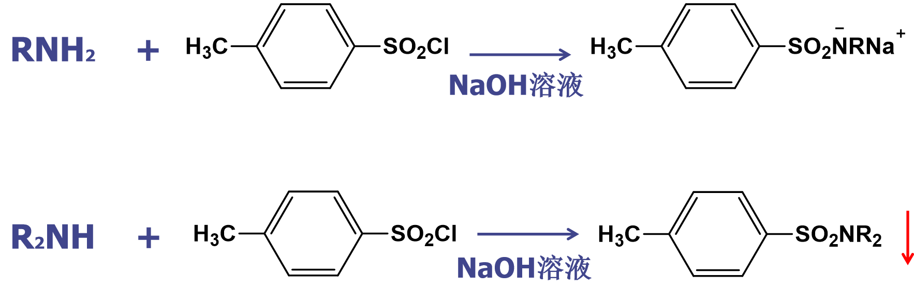
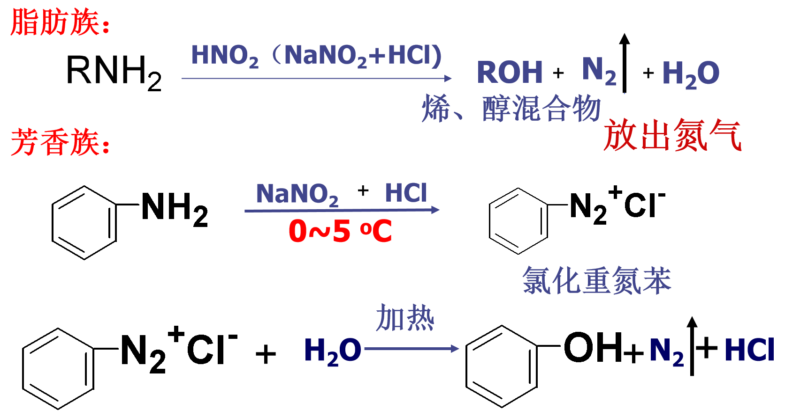
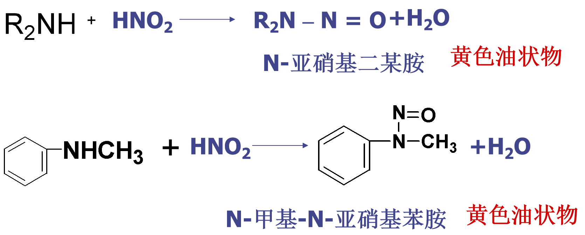
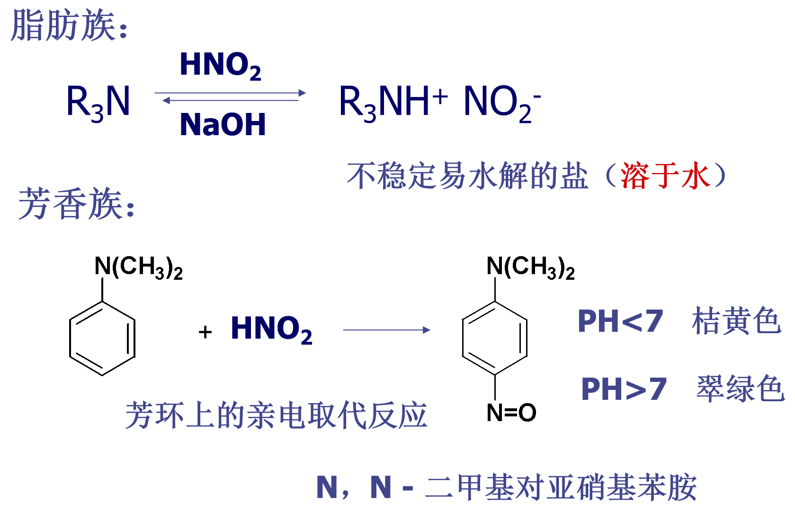
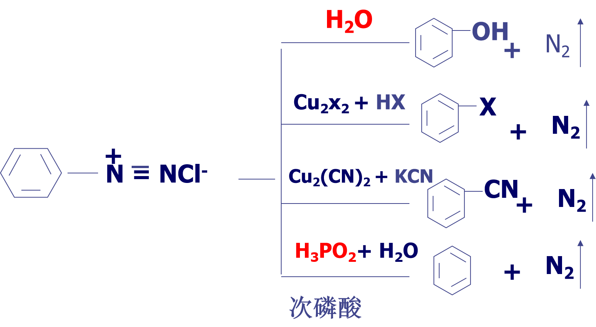
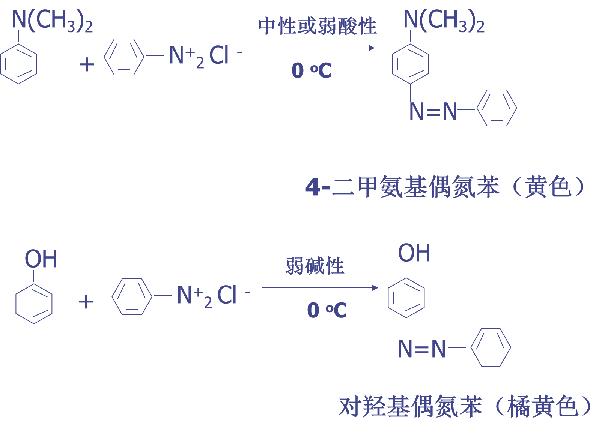

# 含氮有机化合物
## 目的要求
1. 掌握胺的结构、分类、命名及主要的化学性质。
2. 掌握重氮盐的制备和在合成上的应用。
3. 了解一些与医学有关的含氮化合物。

## 命名
1. 以胺为母体
2. 仲胺或叔胺选最长链烃基，命名为某胺，其它烃基看做N位取代基
3. 复杂胺，氨基看作为取代基
## 结构
1. N  原子 $sp^3$不等性杂化
2. 苯胺结构 N 介于$sp^2$和$sp^3$杂化
3. 胺分子中 N 原子连有三个不同的原子或基团时，此 N 原子为**手性氮原子**（但室温下可以相互转化）

## 化学性质
### 胺碱性
* **Kb**：R-NH₂ + H₂O ⇌ R-NH₃⁺ + OH⁻
* **pKb = –log Kb**，越小碱性越强
* **pKa + pKb ≈ 14**（共轭酸/碱互补）
* **强弱顺序**：脂肪胺 > NH₃ ≫ 芳香胺  
  * 脂肪胺：+I 推电子，pKb≈3-5
  * 芳香胺：共振吸电子，pKb≈7-10

| **单一因素** | **机理关键词**                                | **碱性强 → 弱的次序**                 | 速记语      |
| ------------ | --------------------------------------------- | ------------------------------------- | ----------- |
| **水化效应** | 铵阳离子 N-H···O 氢键条数 ↑ → 稳定 ↑          | **伯胺 > 仲胺 > 叔胺**                | “绑水绳”    |
| **电子效应** | 烷基 **+I 推电子↑**；苯环 **p-π 共振吸电子↓** | **叔胺 > 仲胺 > 伯胺 > NH₃ > 芳香胺** | “给/抢电子” |
| **空间效应** | 大基团挡住 H₃O⁺，进攻难                       | **伯胺 > 仲胺 > 叔胺**                | “挡路”      |

**综合三力**

### 成盐反应

- 与**强酸成**盐，与**强碱**可重新析出胺。
- 成盐应用：分离、提纯难溶性的胺
- 制药业：增加胺的水溶性

### 酰化反应

- 叔胺分子不发生酰化反应
- 酰胺水解又可生成原来的胺，所以胺的酰化反应常用来保护氨基。

### 磺酰化反应

| 胺             | 与 p-TsCl 的反应           | 在  NaOH 溶液中      | 加稀 HCl 后           | 结论             |
| -------------- | -------------------------- | -------------------- | --------------------- | ---------------- |
| **伯胺 R-NH₂** | 生成 R-NH-SO₂Ts (仍有 N-H) | **溶解**（生成钠盐） | **再沉淀**            | “溶 → 沉”        |
| **仲胺 R₂-NH** | 生成 R₂-N-SO₂Ts (无 N-H)   | **不溶**             | 仍不溶                | “始终沉”         |
| **叔胺 R₃-N**  | **不发生反应**             | **油状浮层**         | 被酸质子化 → **溶解** | “不反应，遇酸溶” |

### 与亚硝酸的反应

| 胺种类                  | 典型条件                                  | 关键中间体 / 产物                  | 现象 & 考点                         | 写方程小技巧                   |
| ----------------------- | ----------------------------------------- | ---------------------------------- | ----------------------------------- | ------------------------------ |
| **伯胺** ①脂肪 R-NH₂ | **稀酸、常温** HNO₂ 現配               | R-N₂⁺ → 立即崩解 → **R-OH + N₂↑**  | 冒大量 N₂ 气泡 → 实验“定伯胺”       | 别忘 “+ H₂O” 出水              |
| ②芳香 Ar-NH₂            | **0–5 °C、稀 HCl** (NaNO₂/HCl 擬 HNO₂) | **芳香重氮盐 Ar-N₂⁺Cl⁻**（较稳定） | 叫 **重氮化反应**；后续可偶联、取代 | 温度写 0–5 °C，产物标 “N₂⁺Cl⁻” |
| **仲胺** R₂-NH          | **弱酸、0–25 °C**                         | **N-亚硝基胺 R₂N-N=O** (黄油状)    | 无气体；黄油状油层——鉴别仲胺        | 产物写 “+ H₂O” 易漏！          |
| **叔胺** R₃-N           | **稀酸**                                  | 仅 **质子化 R₃NH⁺NO₂⁻**（易水解）  | 无明显现象；生成盐易溶              | 写平衡符号 “⇌”，注“不稳定”     |
| **叔芳香胺** Ar₃-N      | **弱酸～中性**                            | 芳环 **对位电偶氮化 (p-NO)**       | 溶液 pH<7 黄棕；pH>7 绿             | 可考“颜色随 pH 变”             |

## 重氮盐
1. N原子：sp  杂化
2. C – N – N键呈线型结构

- –N≡N⁺ = **超强 –I + 离去基**
- C–N 键极性大 → **一加热/给亲核就断，喷 N₂**
3. **偶联反应**(亲电反应)
    - 重氮正离子为**较弱的亲电试剂**
    - 只能与**芳胺**和**酚**（**活性较高的芳环**）发生亲电取代反应
    - 偶联反应发生的位置：**对位优先**，对位被占，则在**邻位**
    