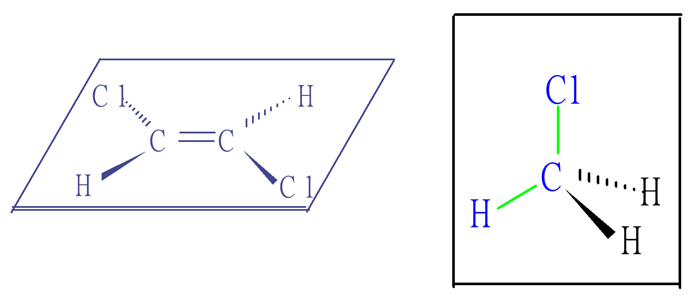
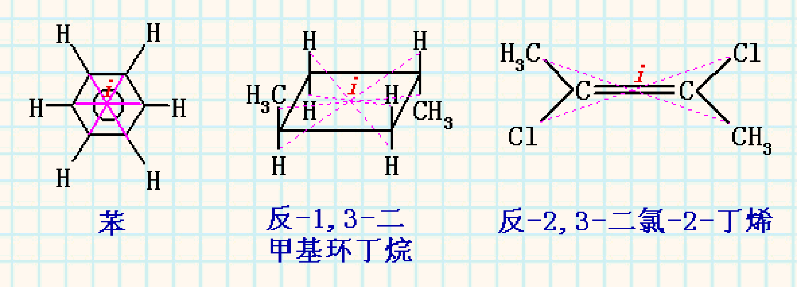
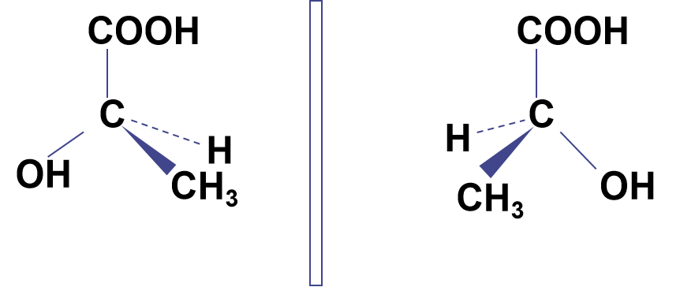
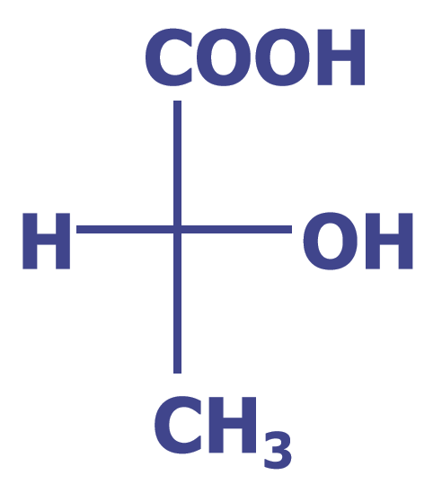
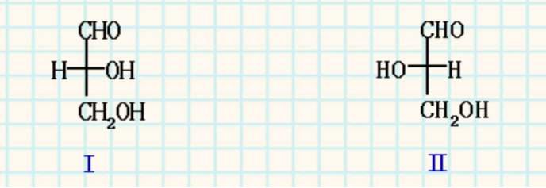
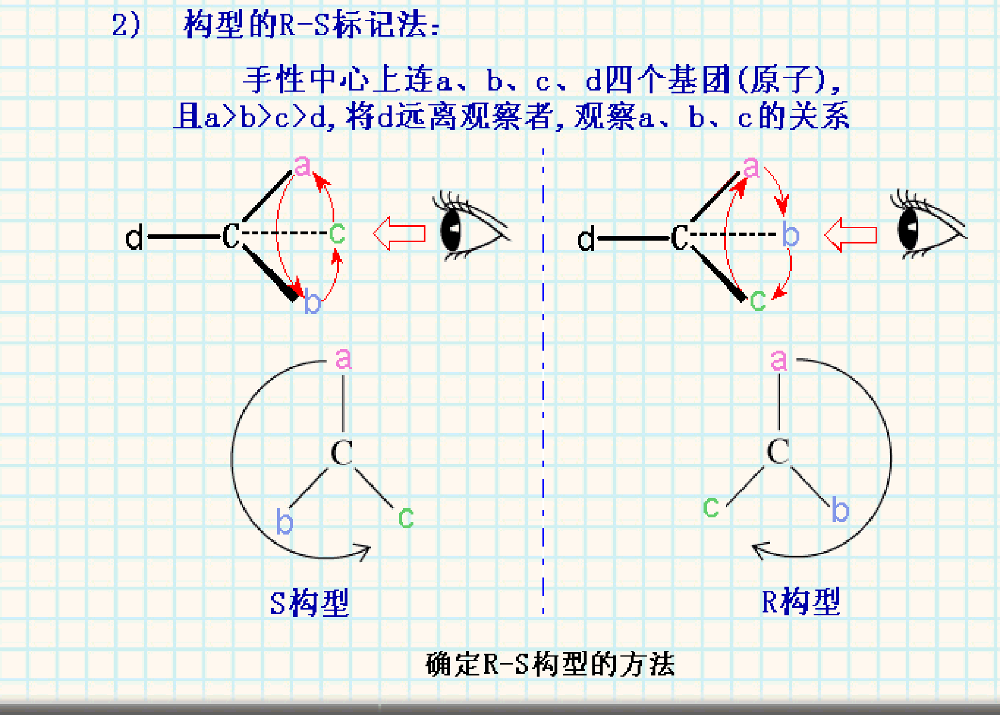
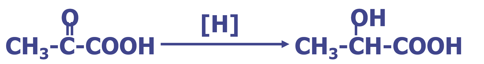
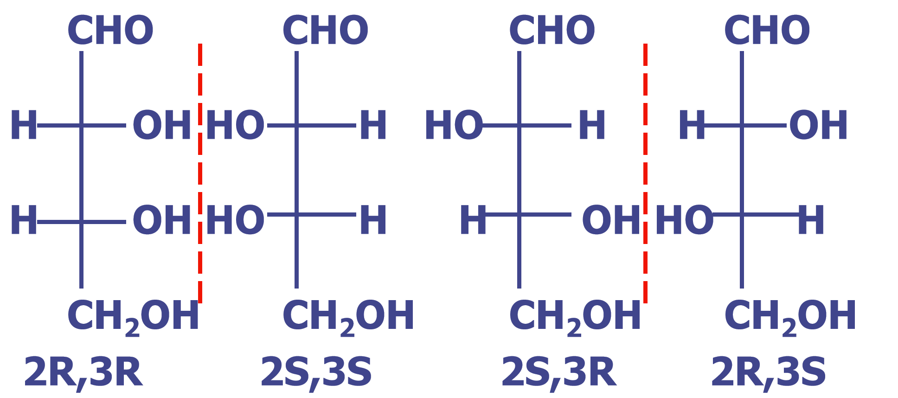
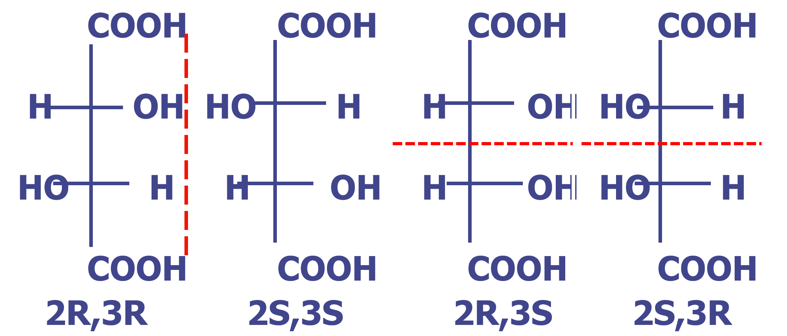

# 旋光现象

**旋光现象**是指光通过某些物质时，其**偏振面**发生旋转的现象。**旋光角度** \( \alpha \) 的定义如下：
- **顺时针**方向旋转为**右旋（+）**
- **逆时针**方向旋转为**左旋（-）**

**\( \alpha_m \)**：**旋光物质的比旋光本领**（质量旋光本领）
单位：\((\degree) \cdot \text{mL} \cdot \text{g}^{-1} \cdot \text{dm}^{-1}\) \((\text{g/mL})^{-1}\)

**比旋光本领**在数值上等于：旋光管长度为1dm，质量浓度为1g$\cdot\text{mL}^{-1}$时的溶液的旋光角。

# 对映体
## 手性、手性分子和对映体

### 手性
**手性**是指物体与其镜像之间，彼此又**不能重合**的现象。

### 手性分子
**手性分子**是指不能与自己的镜像重合的分子。

**说明**：
1. **手性分子**具有**旋光性**
2. **非手性分子**没有旋光性
3. 是手性分子就存在一对**对映体**

### 对映体
**对映体**是**互为镜像但不能重合**的两个分子。

**说明**：
1. 一对对映体旋转平面偏振光的**角度相同**，但**方向相反**。使平面偏振光**顺时针**旋转，称**右旋体**，用 **（+）** 表示；使平面偏振光**逆时针**旋转，称**左旋体**，用 **（-）** 表示。
2. 对映体旋转平面偏振光的方向是**实验测定**的。

### 对映体（enantiomer）的性质

#### （1）物理性质
除**旋转偏振光的方向不同**外，其它的物理性质完全相同。

#### （2）化学性质
在**非手性环境**中，化学性质相同。


## 对映体存在的判断

**分子具有手性**是分子存在对映体的**充分必要条件**

**说明**：
（1）分子和它的镜像的模型不重合。
（2）分子中既无对称面又无对称中心。
（3）分子中仅有一个手性C*。

### 对称因素
1. **对称面**
**对称面**是指通过分子并把分子分为互为镜像的两部分的平面。
    **说明**：
   1. 具有对称面的分子**无手性**，因此**不存在对映体**。
   2. 对称面将分子分为两个完全相同的部分，这两部分互为镜像且可以重合。


1. **对称中心**
**对称中心**（**i点**）是指分子中的一点，从该点出发，沿任一方向延伸一定距离，在相反方向上延伸相同距离，所遇到的原子或基团相同。
    **说明**：
   1. 具有对称中心的分子**无手性**，因此**不存在对映体**。


### 手性碳原子C*
**手性碳原子**（C*）是指与**四个不同的原子或基团**相连的碳原子。

**示例**：乳酸（2-羟基丙酸）分子中的手性碳原子
```
CH₃-CH*(OH)-COOH
```

**说明**：
1. 分子中**只有一个手性碳原子时，该分子一定是手性分子**，必然存在一对对映体。

# 构型的表示方法
## 立体透视式


**表示规则**：
1. **细实线**表示C*及与其共面的两个键
2. **粗实线**表示伸向纸面前方（观察者方向）的键
3. **虚线**表示伸向纸面后方的键

**示例**：乳酸分子的立体透视式

## 费歇尔投影式（Fischer Projections）

**表示规则**：
1. **十字交叉点**表示手性碳原子（C*）
2. **横向键**表示伸向纸面前方的键
3. **纵向键**表示伸向纸面后方的键
4. 主链通常置于**竖直方向**，编号较小的基团朝上

**注意事项**：
1. 费歇尔投影式**不能**离开纸面翻转
2. 费歇尔投影式**不能**在纸面上旋转90°的奇数倍

**示例**：乳酸分子的费歇尔投影式


## 构型的标记

### 相对构型（**D-**，**L-** 构型）

以**甘油醛**（2,3-二羟基丙醛）为标准：

- **D-(+)甘油醛**：羟基向右
- **L-(-)甘油醛**：羟基向左

**命名规则**：
- **D-**（**Dextro**，"右"）表示**右旋甘油醛**
- **L-**（**Leavo**，"左"）表示**左旋甘油醛**

**人为规定**：羟基向右为**D-构型**，羟基向左为**L-构型**。

### 绝对构型（**R-**，**S-** 构型）

**1979**年国际纯粹理论与应用化学联合会采用新的命名解决**D-**，**L-** 构型不能解释的问题。

**R-**，**S-** 命名原则：
1. 将**C*** 所连接的四基团按**优先次序**序排列大小
2. 把**最小基团**放在视线**最远**
3. 其余三基团由大至小排列，**顺时针**者为**R-构型**，**逆时针**者为**S-构型**


#### 费舍尔投影式判断R、S构型的关键点
1. 从最小基团的**同侧**观察分子
2. 观察剩余三个基团的排列方向：
   - 按优先级从大到小排列为**顺时针**，则实际构型为**S-构型**
   - 按优先级从大到小排列为**逆时针**，则实际构型为**R-构型**

# 外消旋体 racemic mixture


产物为左旋和右旋的混合物，一对对映体，旋光数值相等，方向相反，旋光性相互抵消。
**对映体的等量混合为外消旋体**

# 非对映体和内消旋体


## 1. 非对映体
**非对映体**是指彼此不成镜像关系的**立体异构体**。  
分子中含有**两个不同C***

**特点**：
1. 在**非手性环境**下，化学性质相同
2. 具有**不同的物理性质**（如熔点、沸点等）

**立体异构体数量规律**：
1. 分子中含有**两个不同C***，其立体异构体就有**2²个**
2. 分子中含有**n个不同C***，其立体异构体就有**2ⁿ个**

**示例**：2,3,4-三羟基丁醛
 

## 2. 内消旋体（mesomer or meso-forms）
**内消旋体**是含有**两个相同C***的非手性分子。

**特点**：
1. 含有**两个相同C***，异构体数目**少于2ⁿ**。
2. 旋光性在**分子内部相互抵消**，形成**内消旋体**。
3. **内消旋体**为含有**C*** 的**非手性分子**，有**对称因素**。
4. **三种酒石酸混合**（**两个对映体等量**），则**无旋光性**。

**示例**：酒石酸的四种立体异构体

