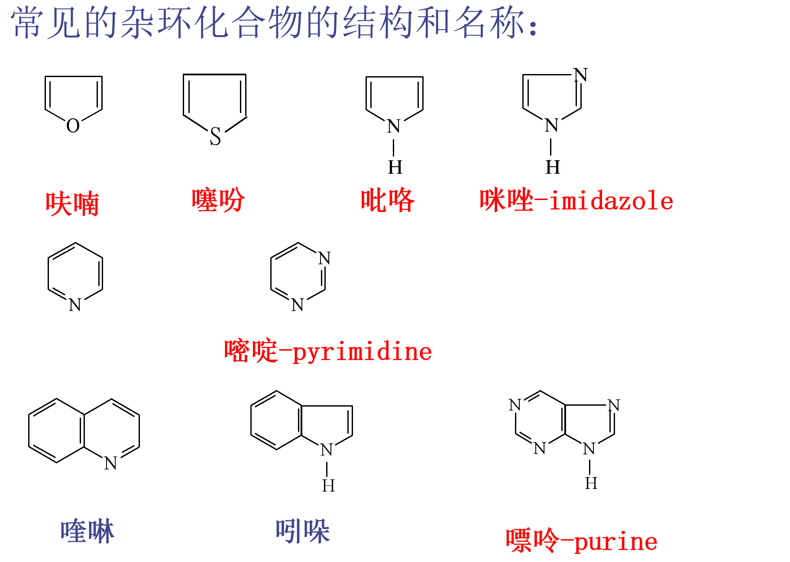
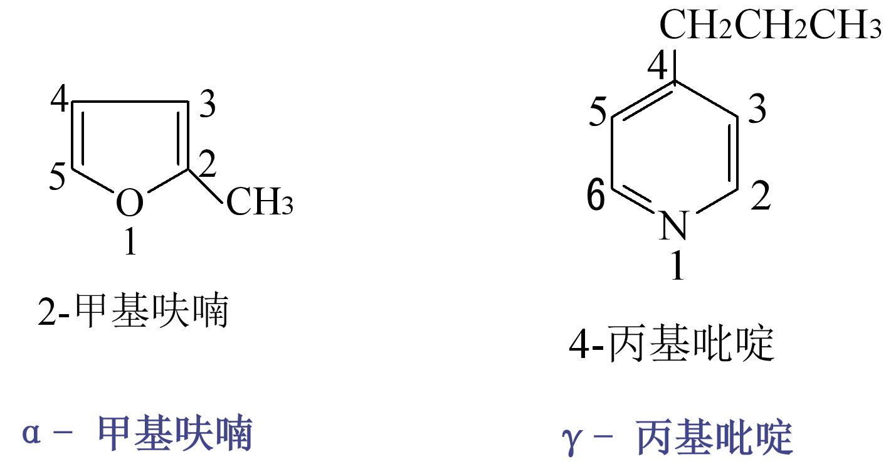
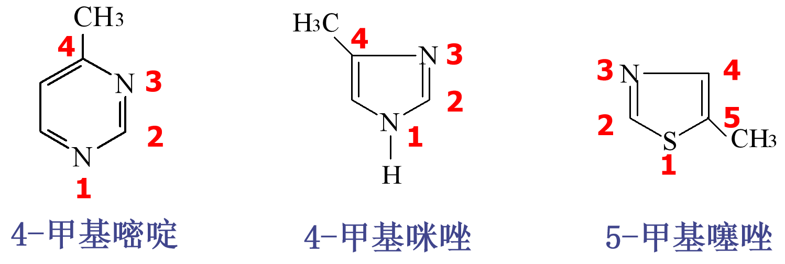
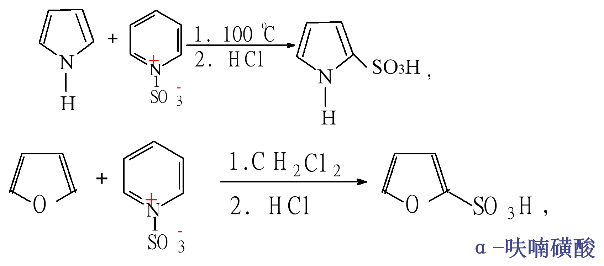
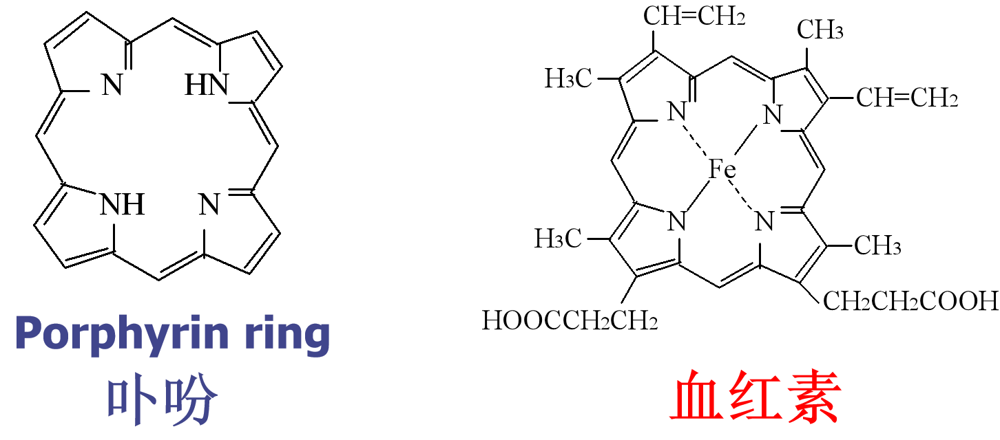

# 杂环化合物
## 目的要求
1. 掌握杂环化合物的概念及命名。
2. 掌握主要的杂环化合物(呋喃、吡咯、噻吩、吡啶、嘧啶、嘌呤)及其衍生物。
3. 了解杂环化合物的**芳香性**。
4. 了解生物碱的结构特征。
## 命名
五元杂环为：戊  +“草字头” = 茂

1. 环中杂原子为“**1**”号。杂原子邻位为“**α**”位

2. 两个以上相同的杂原子，杂原子编号尽可能小
3. 不同杂原子优先顺序按：**O、S、NH、N**编号

4. 杂环上连接**醛、羧酸、磺酸基**时，将杂环作为取代基

## 吡咯、呋喃和噻吩
1. 环内，所有成环原子均为$Sp^2$ 杂化
2. 未参加杂化的p轨道垂直于环面并平行重叠，形成**环状离域大 π键**。
3. 符合 Hückel的 4n+2 规则
4. 稳定性： 苯 ＞ 噻吩＞呋喃＞ 吡咯
5. 亲电取代活性：吡咯＞呋喃＞ 噻吩＞苯

### 亲电取代反应
1. 硝化:(一般采用硝酰乙酸酯作硝化剂)

2. 磺化
    - 噻吩较稳定，可直接与浓硫酸反应，但须在常温下
    - 吡咯、呋喃不能用浓硫酸，通常采用吡啶与三氧化硫的加合物

3. 定位效应
    - 无取代：一定 α(2/5)
    - 3-位有 R：
       - 小给/弱吸 → 2
       - 大吸/强拉 → 5
    - 2-位有 R：
       - 呋喃   → 5
       - 吡咯\噻吩 → 
         - 给电子 / 轻位阻 →  5>3
          - 吸电子 / 大位阻 →  4 or 5

### 加成反应

### α-呋喃甲醛的歧化反应

## 吡咯衍生物
- 血红素：配位键与亚铁离子形成配合物。
- 血红素 + 蛋白质 → 血红蛋白

## 吡啶
1. 吡啶环内所有成环原子均为$sp^2$杂化
2. 未参加杂化的p轨道垂直于环面并平行重叠，形成**环状离域大 π$^6_6$键**。
3. **“N”的“p”轨道中只有一个电子（未共电子对占据一个$Sp^2$）**
4. 符合 Hückel的 4n+2 规则
5. 电子云密度： 苯环 > 吡啶环
6. 吡啶氮原子上一对孤对电子对能与水形成氢键，与水互溶
7. “N”未共电子对未参与共轭，可结合质子，**具有碱性（pkb=8.8）**
    - 季铵碱 > 脂肪胺 > 氨 > 吡啶 >苯胺
    - 与无机酸能形成盐：
    
8. 电子云密度较低，不易进行亲电取代反应
    - 亲电取代活性：  吡咯 ＞    苯   ＞ 吡啶
    - **氮相当于间位定位基**
    - N电负性较大，环上电子向N转移，3位电子云密度较大
      
9. 吡啶的氧化和还原反应
    - 与苯相似，侧链可被氧化为羧酸
      
    - 吡啶较苯易被还原
      
    - 六氢吡啶为仲胺、碱性较吡啶强106倍