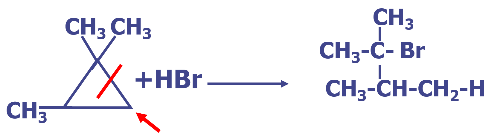

# 烷烃
## 命名

### 链状烷烃
1. 主链择定:选择最长链作为主链（母链）,命名为某烷（甲、乙、丙、丁、戊、己、庚、辛、壬、奎）  
当有两个或多个可选最长长度链时，选择**侧链最多**的最长链作为主链。
2. 给主链上的碳原子编号：
- 从靠近**取代基**的一端开始编号
- 当两端的相同位置各有一个取代基时，则按取代基的**英文名称中的字母**顺序排列编号。

表示取代基个数（二、三、四）的di, tri, tetra等词缀不参与排序

- 当有三个或多个取代基时，从两端**顺次逐位**比较，遇见不同即停止。
3. 烷烃名称的书写：
- 写出主链烷烃的名称；
- 各取代基按英文名称的字母顺序写在主链烷烃名称的前面，并标出各取代基的位次，位次与取代基名称用“-”隔开；
- 若有相同取代基，采用合并的原则；位次之间用“，”隔开，取代基名称前写相应的倍数。

### 环状烷烃
1. 根据环内碳原子数,在烷烃名称前加－“环”字
2. 环上有两个以上取代基时、应使环上的取代基位次最小。按取代基英文名称的字母顺序开始标号
3. 环上有复杂碳链,环作取代基
4. 环烷烃的顺反异构体（cis- trans isomer ）  
产生顺反异构体的原因：
- 有阻碍 C－C 单键自由旋转的因素（双键或环）
- 两个碳原子各连接两个不同的原子或基团

## 构象异构
### 乙烷的构象（Conformation）
- 锯架式

- 纽曼投影式

**乙烷的构象特点:**
- 无数个，两种极端构象：重叠式，交叉式
- 重叠式内能大,基团间距离近,斥力大,不稳定
- 交叉式内能小,基团间距离远,斥力小,稳定
- 构象之间转变不断键,只是键轴“自由”旋转
- 不易分离

### 正丁烷构象

**长链直链烷烃的构象**：优势构象是能量最低的对位交叉式、 碳链以锯齿形排列。

### 环丙烷结构特点
1. 键夹角为105.5°
2. 仍为sp3杂化
3. “香蕉”弯曲键，重叠程度差
4. 电子云外露，易受亲电试剂进攻，发生离子型的亲电加成反应

### 环己烷构象

- 能级差小，可以互变，不可分离
- 室温下，椅式占99.9%，船式占0.1%

- a键，直立键，与环面垂直。（6个），能量较高
- e键，平伏键，与环面基本平行。（6个）,能量较低
- 环面为 C，1, 3,5；及C，2, 4, 6两个平行面

## 化学性质
1. 稳定性：与强酸、强碱、强氧化剂、还原剂均无作用
2. 卤代反应：光照卤代，属共价键均裂的自由基取代反应

多碳烷烃卤代反应的取向
- 氢的反应的相对活性顺序  
叔氢  > 仲氢  >  伯氢原子
- 主要产物由相对活性和反应几率决定  
卤素在烷烃卤代中的反应活性顺序为：F2 > Cl2 > Br2 > I2  
F2 太活泼， I2需吸热；一般只用Cl2 和Br2来进行烷烃的卤代反应，其中Br2活性小，但具有高选择性。
### 环烷烃 
1. 加氢

氢化后，小环易开环成链烷烃，大环则不发生加氢反应
2. 亲电加成反应

环丙烷的烷基衍生物开环时注意：
- 从含氢较多和含氢较少处开环
- 氢加在含氢较多的碳原子上
- 具有烯烃部分性质

## 重要烷烃
1. **石油醚**  低级烷烃混合物（戊烷、己烷），主要用作有机溶剂，易燃、有毒。
2. **液体石蜡**  9~16个碳原子的液体烷烃混合物，透明状液体。临床上用作肠道润滑
3. **凡士林**   18~22个碳原子的烷烃混合物，Vaseline   半固体状。医药上作为药物的载体、基质。  护肤品

 