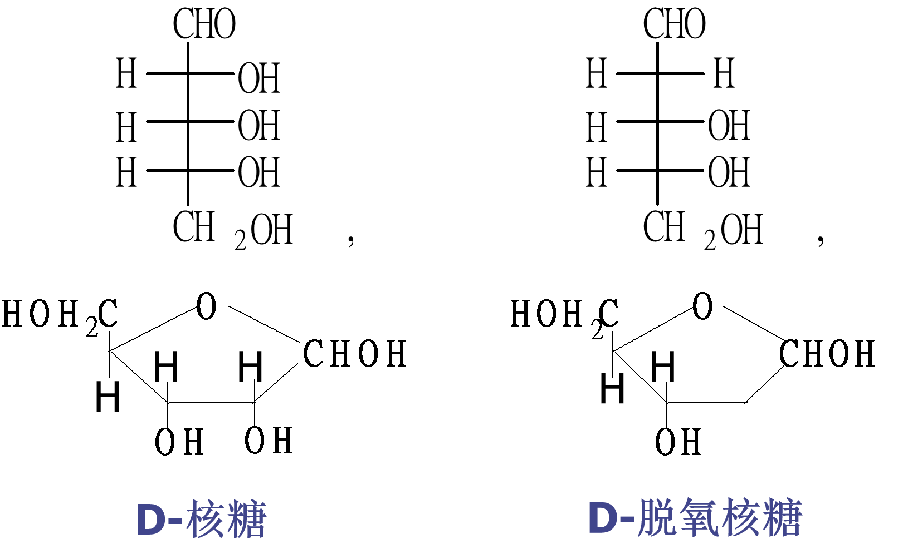

# 糖
## 目的与要求:
1. 掌握糖、差向异构、端基异构、还原性糖、还原性糖、糖苷、苷键和苷羟基的概念。

2. 掌握重要的单糖结构、性质。

3. 掌握差向异构化现象及变旋光现产生的条件。

4. 熟悉重要二糖结构、性质。

5. 了解糖类化合物在生命过程的重要生理功能。
## 单糖构型
单糖构型用**D, L构型**标记法标记
- 判定：**Fischer** 投影里，看**编号最大**手性碳(最下面那位)的 OH
- **右 → D 左 → L**

- 存在于自然界的单糖绝大多数为**D型**。
## **葡萄糖**
1. **D / L 判定**  
   - Fischer 投影中，与 **编号最大手性碳**(葡萄糖的 C-5)上 OH → 右 = **D**，左 = **L**  
   - 仅分“家族”，同族内仍可有多种差向异构体

2. **差向异构体 (Epimer)**  
   - 只翻转 **1 个手性碳**的非对映体  
   - 例：D-葡萄糖 ↔ D-甘露糖(C-2)；D-葡萄糖 ↔ D-半乳糖(C-4)

3. **环状半缩醛的形成**  
   - 葡萄糖常由 **C-1(醛基) ←→ C-5-OH** 自互加成 → 六元 **吡喃环**  
   - C-1 变“半缩醛碳”(1 OR + 1 OH)，因此不被羟胺/HSO₃⁻ 等羰基捕手攻击，只能再接 1 醇生成糖苷

4. **端基异构体 / 异头物 (Anomer)**  
   - 环化时 C-1-OH 方向不同：**α**(OH ↓ 与 CH₂OH 反向)、**β**(OH ↑ 同向)
   - 说明：β-D-吡喃葡萄糖 比 α-D-吡喃葡萄糖稳定  
   - α、β 互为 **端基异构**，也是特殊的差向异构

5. **葡萄糖变旋 (Mutarotation)**  
   - 冷乙醇结晶 ⇒ α-D-葡萄糖 (+112 °)  
   - 热吡啶结晶 ⇒ β-D-葡萄糖 (+18.7 °)
   - 水溶液中：**α-D(+112°) ⇄ 0.003 % 开链 ⇄ β-D(+18.7°)**  
   - 热力学平衡 **α : β ≈ 36 : 64** → 比旋光度 **+52.7°** 恒定（**右旋**）  
   - 互变仅限同一 D 系列；L-葡萄糖将趋于 –52.7°
   

6. **碱性差向异构化 (epimerization)**
   - 在碱性条件下，**D-葡萄糖 ⇄ D-甘露糖** 可以通过 **中间体烯二醇(ene-diol)** 互转，这种只翻转一个手性碳的过程叫 *差向异构化*。
   

7. **成苷反应（缩醛或缩酮）**
   
糖苷无变旋光现象、无还原性

8. **溴水氧化分辨 (pH ≈ 6)**
   - **醛糖 + Br₂ → 糖酸 + Br₂褪色**（弱氧化仅把端基醛 → 羧酸）
   - **酮糖 + Br₂ → 无反应**（酮基在中性溴水下不被氧化）
   - 此反应可**鉴别醛糖和酮糖**，**醛糖可使溴水褪色**。

9. **浓硝酸氧化 → 糖二酸 (aldaric acid)**
   - 条件：HNO₃(浓) + Δ
   - 结果：−CHO & −CH₂OH 同时 → −COOH
     ├─ D-葡萄糖 → D-葡萄糖二酸（旋光）
     └─ D-半乳糖 → 黏糖酸（meso，无旋光）★实验室常靠“生成白色不溶晶”鉴别半乳糖
   - 意义：快速区分不同醛六糖；黏糖酸大量生成可作增稠剂
    

10. **成脎反应 (osazone)**
    糖 + 3 PhNHNH₂(过量, Δ) → “糖脎” (C₁& C₂ 各 =N–NHPh)
    
    - 只在 **C₁**、**C₂** 发生，生成黄色晶体，熔点/形貌可鉴糖
    - 葡萄糖 = 果糖 = 甘露糖 → 同一针状葡萄糖脎
    - 反应原理：先腙化 → 苯肼自氧化改 C₂ → 再腙化

11. **磷酸化成酯 → 葡萄糖-磷酸酯 (Glc-P)**
    - 化学：糖-OH + **ATP → 糖-O-PO₃²⁻ + ADP**
    - 体内两大产物：
        ├─ **β-D-葡萄糖-6-磷酸酯 (G-6-P)** ← Hexokinase 首步捕糖
        └─ **α-D-葡萄糖-1-磷酸酯 (G-1-P)** ← 磷酸变位酶由 G-6-P 转位
    - 作用：
        - 带负电 → 锁定胞内、避免自由扩散
        - 预活化 → 驱动糖酵解 & 糖原合成/分解（后续再把 ADP 重新磷酸化成 ATP）

## 重要糖
1. **D-核糖和D-脱氧核糖**（ribose and deoxyribose）

2. **D-葡萄糖**
    - 有变旋光现象。属于**还原糖。**

3. **D-半乳糖（D-Galactose）**
    - d有还原性，属于**还原糖**，有变旋光现象
    

4. **D-果糖   fructose**
    - 果糖比旋光度为 -92ｏ故称**左旋**糖
    - 天然糖中甜度最高
    - 虽是酮糖属于**还原糖**

5. **蔗糖 sucrose**

- **无还原性**
- **无变旋光现象**
- **蔗糖转化反应 (invert sugar)**
    - 反应：蔗糖(+66.7°) + H₂O —(酸 / invertase)→ 等量葡萄糖(+52°) + 果糖(-92°)
    - 结果：比旋光度变为 –19.7°，方向由右旋 → 左旋 → 称“转化”

6. **麦芽糖 maltose**

- 结构：α-D-Glu-(1→4)-Glu
- 结晶状态半缩醛羟基为β型。水溶液为α型 和β型混合物
- **有还原性、变旋光现象**

7. **纤维二糖 cellobiose**

- 结构：β-D-Glu-(1→4)-Glu
- **有变旋现象,为还原二糖**

8. **乳糖 lactose**

- 结构：β-D-Gal-(1→4)-D-Glc
- **有还原性、变旋光现象**

9. **淀粉 starch**
- 直链型（糖淀粉）
  
    - 直链淀粉 (amylose)：α-1,4，螺旋→遇碘显蓝，无还原性无变旋光现象
- 支链型（胶淀粉）

    - 支链淀粉 (amylopectin)：α-1,4 主链 + α-1,6 分支，每 20-25 单元，遇碘红紫，无还原性无变旋光现象
- 淀粉(蓝) ─α-淀粉酶→ 红糊精 → 无色糊精 → 麦芽糖 ─麦芽糖酶→ α-D-葡萄糖
    - 糊精阶段仍无还原性；麦芽糖起始显还原性
10. **纤维素 (cellulose)**
 
    - 结构：β-D-Glu-(1→4)-β-D-Glu 直链重复；无 α-1,6 分支
    - 链间大量 H 键 → 紧密平行微纤维；不溶水、不与碘显色
    - 无还原性、无变旋（两端 C-1 都被苷键锁定）
    - 酶解：需纤维素酶（β-1,4-葡萄糖苷酶）才能水解 → D-葡萄糖

11. **糖原 glycogen**
- 分子呈树枝形
- 分子量:3000~35000
- 每隔8～10 D-葡萄糖单位分一支
- 主链以: α-1, 4-苷键相连
- 分枝以: α-1, 6-苷键相连
- 存在于肝脏与肌肉,是葡萄糖储存的形式