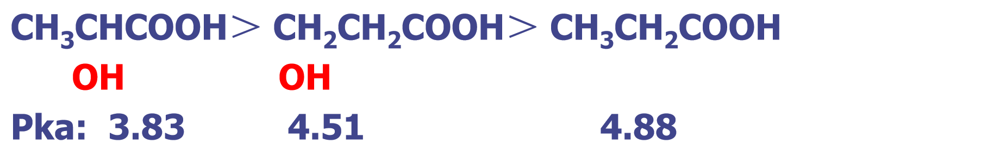

# 羧酸   Carboxylic  acid
## 命名
- 含羧基最长碳链；羧基碳为1
- 按所含碳数叫 某酸、某烯酸、某炔酸

## 羧酸酸性
1. **– I效应：使酸性增强**  
F-CH2COOH﹥Cl-CH2COOH﹥Br-CH2COOH﹥I-CH2COOH 
2. **＋I效应：使羧酸根负离子稳定性降低，使酸性减弱**  
HCOOH﹥CH3COOH﹥CH3CH2COOH﹥(CH3)2CHCOOH﹥(CH3) 3CCOOH
3. **共轭效应**  
   - π键及苯环大 π键与羰基C ＝ O形成共轭体系，使羧酸根负离子更稳定，使酸性增强
   - 酸性强于相应非共轭羧酸，但比甲酸弱

## 羧酸成盐
- 羧酸与  NaOH，  NaHCO3，Na2CO3 成盐
- 苯酚只与 NaOH 成盐，可区分羧酸与苯酚
- 医药上常把药物转变为盐增加其水溶性

## 羧酸衍生物的生成
### 酰卤的生成
- 常用卤化剂：PX3、PX5 （X=Cl、Br）
- SOCl2 （亚硫酰氯或氯化亚砜) 做卤化剂，产物除酰氯外均为气体，产物纯净

### 酸酐的生成
- 常用脱水剂：P2O5 
- 反应：两羧基间失水生成酸酐

### 酯的生成

- 反应是可逆的
- 为提高收率，常选择加入过量廉价的酸或醇
- 伯醇和仲醇与羧酸的酯化是按酰氧键断裂进行的。
- **叔醇**与羧酸的酯化是按**烷氧键**断裂进行的。
- 影响酯化反应速率的因素
  - 空间位阻

### 酰胺的生成

酰胺还可通过酰卤、酸酐或酯的氨解获得。

## 二元酸的加热反应
### 乙二酸及丙二酸加热脱羧
脂肪酸α－位上有吸电子基团存在时，发生脱羧反应。

- 一元羧酸较难脱羧
- 当α – 碳上连有吸电子基团时则易脱羧

### 丁二酸、戊二酸加热脱水生成酸酐

### 己二酸、庚二酸加热脱羧、脱水生成环酮

### 三类二元酸加热反应
- 乙二酸、丙二酸加热脱羧成一元酸
- 丁二酸、戊二酸加热脱水成酸酐
- 己二酸、庚二酸加热脱羧、脱水成环酮

## 氧化、还原反应
- HCOOH 因为有与羰基相连的氢，所以可被氧化
- 羧酸可被LiAlH4还原为相应的醇

## α-氢原子的卤代反应

- P 红 和 PBr3一定是催化剂的量
- α – 卤代酸可用来制备： α – 羟基酸、 α – 氨基酸等

# 羟基酸
- 羟基酸具有醇(酚)和羧酸的通性
- 羟基在脂肪酸烃基上表现出－I效应，酸性增强

- α－醇酸分子中的羟基受羧基－I效应的影响，羟基易被氧化
  - 发生银镜反应的有机化合物有醛、甲酸、α－羟基酸等

- β—醇酸     羟基与α－H消除——生成α，β－不饱和羧酸

- γ－醇酸和δ－醇酸易发生分子内脱水——生成内酯

- γ－醇酸易脱水，难得到，通常以γ－醇酸盐的形式保存

- 酚酸酸性受羟基和羧基相对位置影响。
  - 酚羟基：有酸性，与FeCl3显色
  - 羟基在芳环上表现出＋C 和邻位效应

- 酚酸的脱羧反应
  - 羟基在羧基邻、对位的酚酸，加热至熔点以上，脱羧成酚

# 酮酸    Keto acid
- 根据酮羰基和羧基的相对位置不同，分为α、β、 γ… 酮酸
  - 糖、油脂和蛋白质代谢主要产生α－酮酸和 β－酮酸
- 酮酸的命名以羧酸为母体，酮基作取代基位置用α、β、 γ标明
  - 新版本把酮基叫做氧亚基
- 酮酸的酸性＞相应的醇酸
  - 羰基氧吸电子能力强于羟基

- 脱羧反应
  - α－酮酸加热脱羧成α－醛

  - β－酮酸加热脱羧成β－酮
