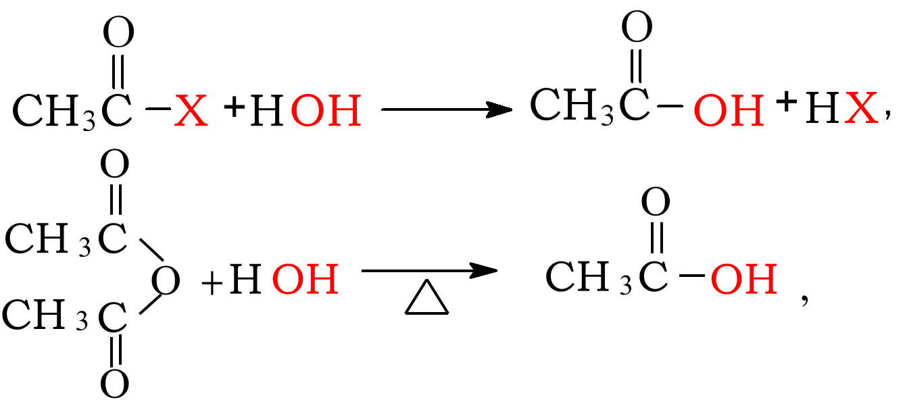
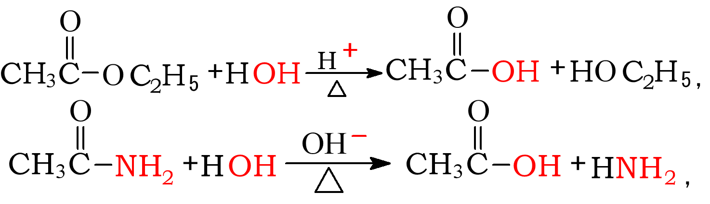
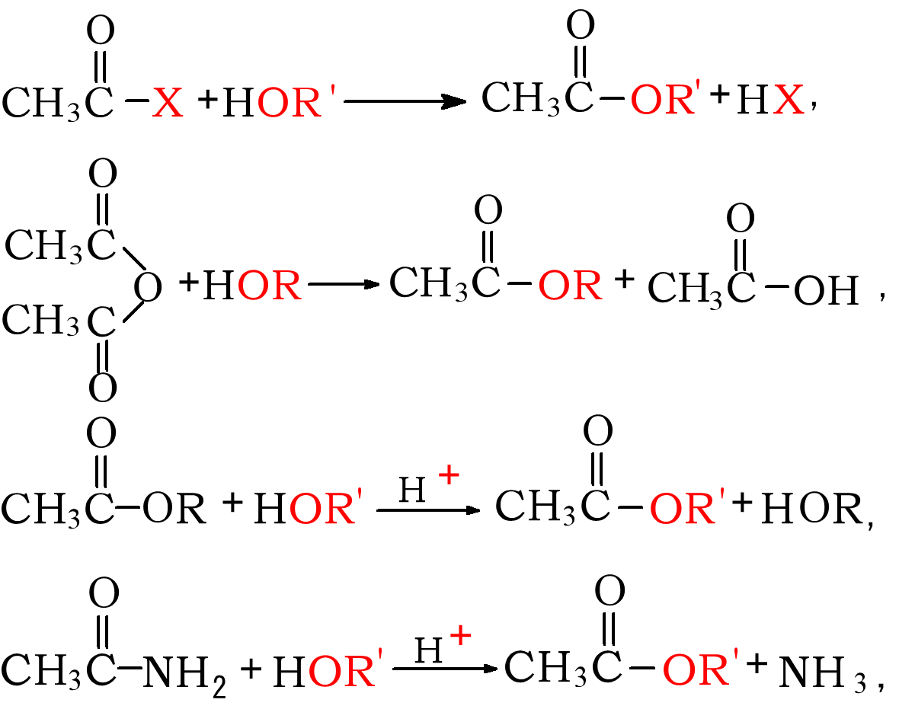
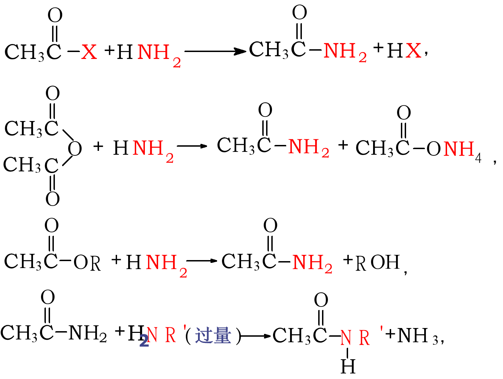
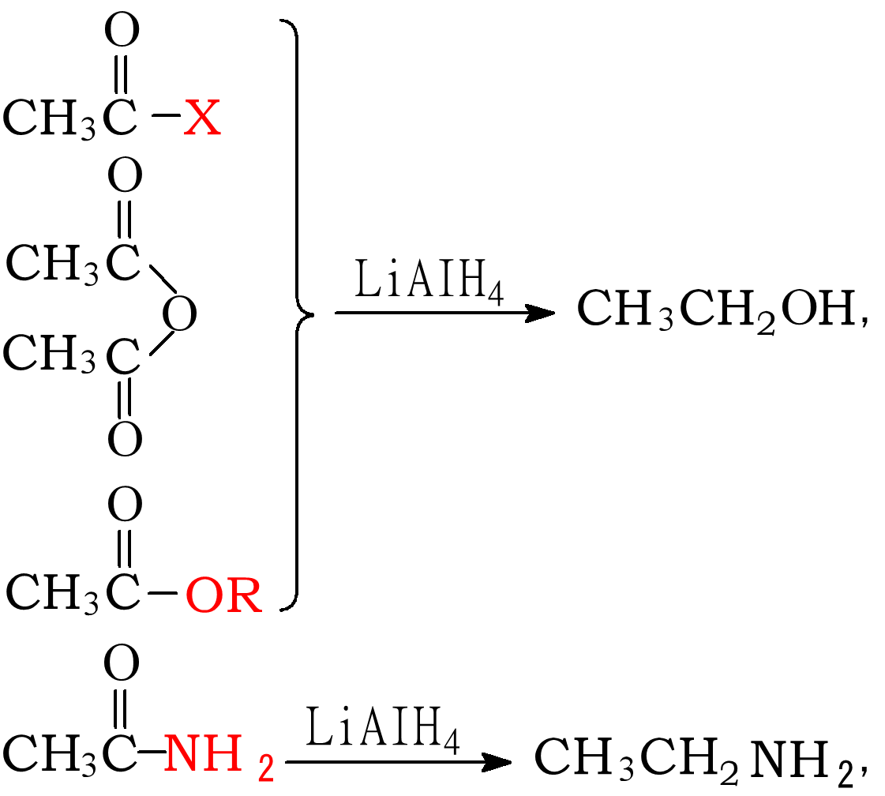
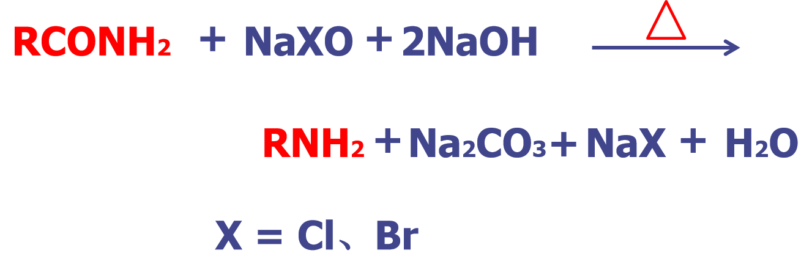

# 羧酸衍生物
## 重点
1. 掌握羧酸衍生物的化学性质。
2. 掌握羧酸衍生物的制备。
3. 熟悉尿素的结构及性质。
4. 熟悉羧酸衍生物的某些代表物。

## 亲核取代反应

### 水解反应

### 醇解反应

### 氨解反应

酰胺的胺解是可逆反应，酰胺的氨解要用亲核性更强的胺

- 酰卤 > 酸酐 > 酯 > 酰胺
- 羰基碳的活性不同
- 碱性弱，有利离去基团的离去，故离去顺序是 (－ X > － OCOR > － OR > － NH2)

## 还原

1. LiALH4具有高选择性,不还原碳碳双键。
2. 反应物不同产物不同
3. 氢化铝锂（LiAlH4）（特点：还原能力强，可以还原COOH、酰卤、酸酐、酰胺、COOR、C=O、CN、NO2等，不能还原C=C、C≡C）
4. 硼氢化钠（NaBH4）（特点：还原不如LiAlH4强，具有较高的选择性，可还原酰卤、C=O，而C=C、C≡C、COOR、COOH、CN、NO2、酰胺等不能被还原）

## 酰胺的特性
1. 酰胺由于形成p-π共轭体系，碱性比氨弱
    - 邻苯二甲酰亚胺显酸性

2. 与亚硝酸的反应

3. 霍夫曼降解反应

## 碳酰胺衍生物
- 碳酸是两个羧基共用一个羰基的二元酸，极不稳定，不能游离存在
- 其碳酸衍生物也极不稳定，但碳酸的双衍生物很稳定是合成药物的原料
- 尿素 （脲）urea
  - 化学名：碳酰二胺

- 弱碱性

- 水解

- 与亚硝酸反应

- 缩二脲的生成

 缩二脲的碱性溶液 + 硫酸铜溶液------显紫红色

## 酮式—烯醇式互变异构现象
- 生成烯醇式结构的三条件：
  1. 亚甲基上活泼氢（质子化）
  2. 分子内形成氢键
  3. 共轭体系的延伸