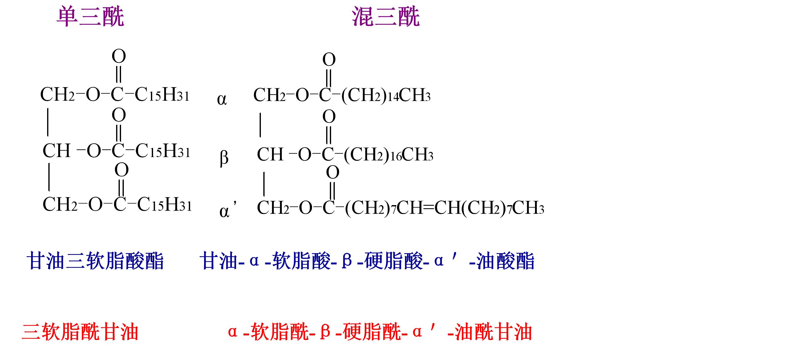
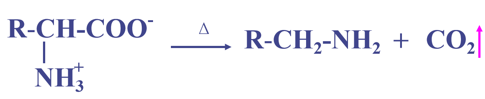
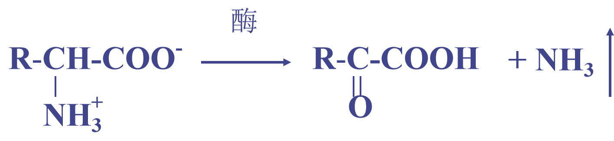
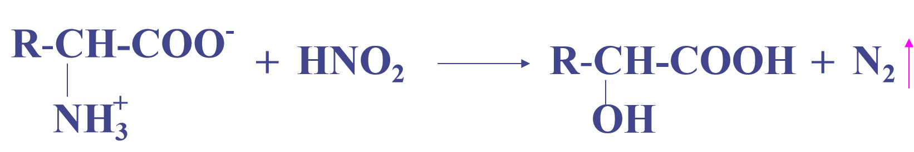
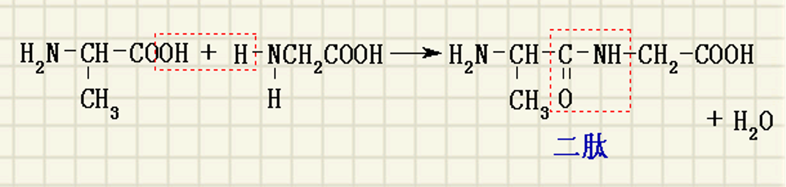
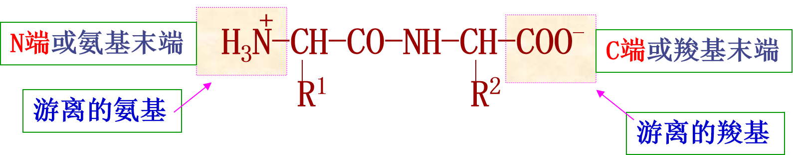
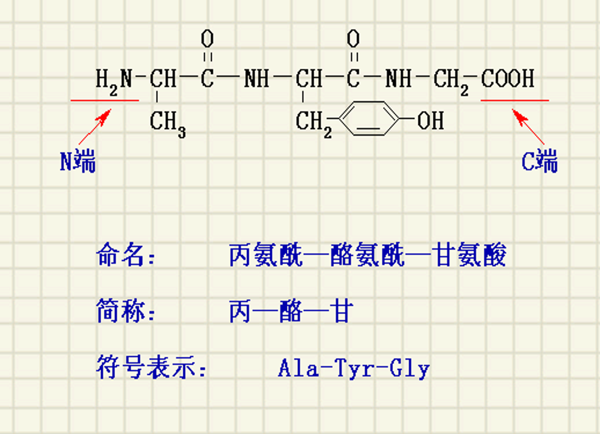
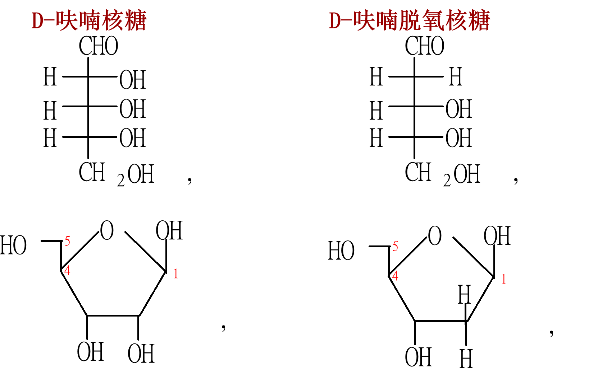
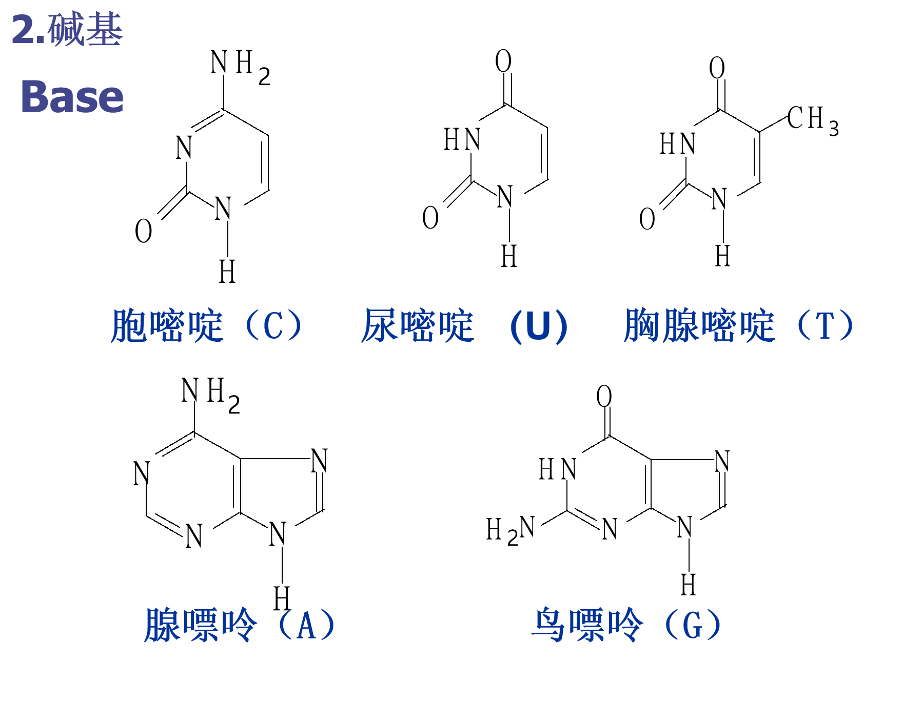

# 脂类
## 目的要求
1. 脂肪酸的结构
2. 油脂的结构和性质
3. 磷脂、甾族化合物的组成、结构
## 结构和命名
1. 三酰甘油当三条脂肪酸不同时β-C可以有s手性
2. 脂肪酸分类
    - 饱和
      - 软脂酸 十六碳酸
      - 硬脂酸 十八碳酸
    - 不饱和
      - 油酸 9－十八碳烯酸
      - **亚油酸** 9，12－十八碳二烯酸
      - **α－亚麻酸** 9，12，15－十八碳三烯酸
3. 必需脂肪酸： （**亚油酸**，**α－亚麻酸**）
4. 命名

## 油脂的化学性质
1. **油脂在碱性溶液中的水解叫做皂化**

    - 皂化值：lg油脂完全皂化所需要的氢氧化钾的mg数
    - 皂化值越大、平均分子量越小
2. **氢化反应**
    - 油脂氢化又叫做油脂的硬化（人造黄油）
3. **加碘（ICl氯化碘   IBr溴化碘）**
    - 碘值：100g油脂所能吸收碘的g数
    - 测定油脂不饱和度、碘值大、不饱和程度高
4. **氧化反应（酸败）**
* **过程**：空气 O₂、水、微生物 → 氧化、脱氢、水解；双键断裂生成醛、酮、羧酸，气味变劣。
* **标志**：游离脂肪酸 (FFA) 含量↑。
* **酸值**：中和 1 g 油脂中 FFA 所需 KOH 的 mg 数。
  * 酸值↑ → 酸败程度↑。

## 磷脂

- 规定：C$_2$上的羟基写左、氢原子写在右为Sn（L构型）
- 自然界存在的磷脂都属Sn－构型
1. **α－卵磷脂(磷脂酰胆碱)**

2. **α－脑磷脂（磷脂酰乙醇胺）**

3. **鞘磷脂**
（神经氨基醇）鞘氨醇＋磷酸＋胆碱＋脂肪酸

## 甾族化合物
1. 甾族化合物的母核（即基本骨架）

# 氨基酸
- 组成蛋白质的基本单位氨基酸:20种
- 脯氨酸为α-亚氨基 
- 氨基酸的内盐基结构（即偶极离子）X－射线衍射分析证明、固态氨基酸呈离子状态。
- 生物体内20种常见的氨基酸多为L型
- 甘氨酸除外
- 20种常见的氨基酸中，除甘氨酸外，其他19种均有旋光性。
- 若用R、S标记法，除半胱氨酸为R构型外，其余18种皆为S构型。
## 要求记忆的几种氨基酸
1. **甘氨酸**：最简单的氨基酸，R基为H。

2. **丙氨酸**：R基为甲基。

3. **丝氨酸**：R基为羟甲基。

4. **半胱氨酸**：R基为硫醇基。

## 理化性质
### 等电点
- 等电点：氨基酸在溶液中呈离子状态时，正负电荷相等的pH值。
- 「pH > pI → 负；pH < pI → 正」+「负往正极，正往负极」

### 脱羧反应

### 脱氨反应

生物体内氨基酸分解代谢的最主要反应。
### 与亚硝酸反应

- 测定反应定量释放N2， 常用于氨基酸和多肽的定量分析。
- 脯氨酸分子中含有亚氨基，亚氨基不能与亚硝酸反应放出氮气。
### 显色反应

- 但亚氨基酸（脯氨酸和羟脯氨酸）呈黄色
- 茚三酮在层析法中作为指示剂
- 鉴别α-氨基酸和蛋白质的试剂
- 灵敏度高
### 成肽反应
两分子α-氨基酸受热脱水形成环状二酰胺

在酸性条件下生成二肽

# 肽  peptide

# 核酸

