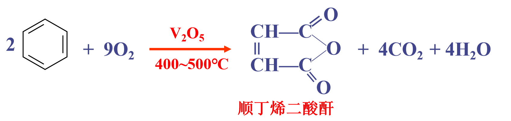
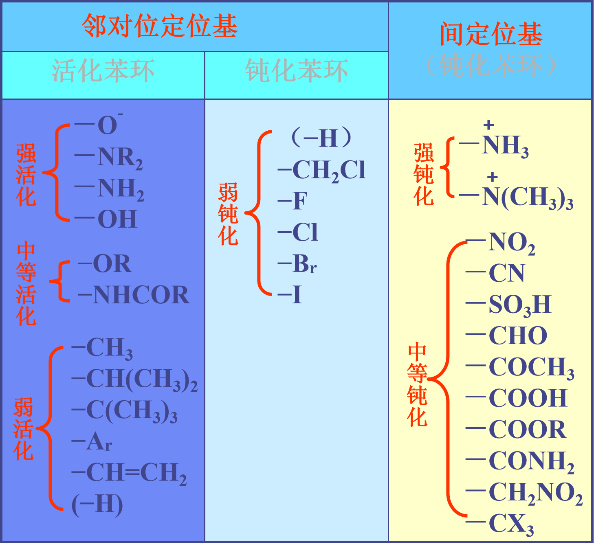

# 芳香烃分类

# 芳香烃命名
## 单环取代芳烃命名
1. 把烃基作取代基，苯作母体

适用于取代基为简单烃基
2. 连有多个**相同**简单烃基取代基时

3. 当苯环连有多个**不同**简单烃基取代基时

使取代基编号依次最小
4. 连有复杂或不饱和烃基，苯作取代基

## 苯的衍生物命名
1. $\ce{-R}$、$\ce{-X}$ 、$\ce{-NO_2}$ 与苯相连时，苯作母体

2. 当苯环上有 $\ce{-OH}$、$\ce{-NH_2}$、$\ce{-SO_3H}$、$\ce{-CHO}$、$\ce{-COOH}$ 时

3. 有多种官能团时，母体选择优先顺序为：（排前作母体，排后作取代基）
- **书表 5-3，P92**
- 当涉及到更多官能团时，其化学式规范表达如下：
- $\ce{-COOH}$、$\ce{-SO3H}$、$\ce{-COOR}$、$\ce{-COX}$、$\ce{-CONH2}$、$\ce{-CN}$、$\ce{-CHO}$、$\overset{\Large{\stackrel{\mathrm{O}}{\|}}}{\mathrm{-C}}-\mathrm{R}$、$\ce{-OH}$、$\ce{-NH2}$

## 多环芳烃命名
多苯代脂肪烃，以脂肪烃为母体，苯环作为取代基。

## 稠环芳香烃命名

### 萘衍生物命名

# 单环芳香烃
## 苯的结构  （benzene）
1. **平面正六边形**，6个氢与6 个 碳都在同一个平面上。sp2杂化。（共平面性）
2. **键角都是120°**
3. **碳碳键长都为0.139nm.**
4. 每个碳都以三个**sp2**与相邻两个碳和一个氢形成三个σ键、 **6个未杂化轨道平行重叠,形成闭合共轭体系，π电子高度离域，形成环形大π键**

# 芳香烃特点
1. 碳氢比高

2. 碳碳键长介于 $\ce{C - C}$ 与 $\ce{C = C}$ 之间

3. 对于氧化作用有相当大的抗力
4. **易亲电取代,难加成**
5. 具有一定的毒性

# 芳香烃化学性质
## 亲电取代反应
### 反应机理

>1. 亲电试剂进攻苯环，形成π配合物（快速可逆）
>2. π配合物转变为σ配合物（慢速可逆）
>3. σ配合物失去H+，生成取代产物（快速不可逆）

### 常见亲电试剂
- $\ce{X+}$：卤素正离子
- $\ce{NO2+}$：硝基正离子
- $\ce{SO3+}$：硫酸正离子
- $\ce{R+}$：烷基正离子
- $\ce{R-C+=O}$：酰基正离子

### 1. 卤代反应
- 卤素：$\ce{Cl2}$、$\ce{Br2}$
- 催化剂：$\ce{Fe}$、$\ce{FeX3}$

### 2. 硝化反应
**混酸**————浓 $\ce{H2SO4}$ 与浓 $\ce{HNO3}$ 混合

### 3. 磺化反应

### 4. 傅瑞德—克拉夫茨（Friedel-Crafts）反应
包括：
- 烷基化——被-R取代
- 酰基化——被R-C-取代（C与O双键）

#### (1) 烷基化反应
- 催化剂：$\ce{AlCl3}$、$\ce{FeCl3}$、$\ce{BF3}$等路易斯酸
- 烷基化试剂：卤代烃、烯烃（质子酸）等
- 特点：当大于三个碳原子的直链烷基引入苯环时，会发生烷基的异构化现象，这是由于碳正离子的重排导致的，最终生成的产物以支链烷基取代产物为主

  - 原因是：

反应示例：

#### (2) 酰基化反应

- 催化剂：$\ce{AlCl3}$等路易斯酸
- **傅-克酰基化反应没有重排现象**
- 苯环上已连接有**强吸电子基团**时，不能发生傅-克酰基化反应

## 加成反应
### 1. 加氢

### 2. 加氯

## 芳烃侧链上的反应
### 1. 光照侧链卤代

### 2. 侧链氧化
氧化剂：$\ce{KMnO4}$、$\ce{K2Cr2O7}$ / $\ce{H^+}$

#### 氧化规律：
1. 不管支链多长，氧化都得到**苯甲酸**
2. 不管有多少支链，氧化都在原支链位置上生成甲酸
3. **不含α-H的支链不能氧化**

#### 应用：
1. 在合成上使苯环引入羧基（$\ce{-COOH}$）
2. 可定性测得多元烃取代苯支链的位置

#### 破环氧化
氧化剂：$\ce{V2O5}$

在 400~500℃ 条件下，$\ce{V2O5}$ 可将苯环破坏，生成顺丁烯二酸酐

# 亲电取代定位规律
## 定位基
在苯环上引入新的取代基时，其进入苯环的位置，主要决定于原有取代基的性质。这个**原有的取代基称为定位基**。

## 定位基类型
1. **邻对位定位基**：属**第一类定位基**，能**活化**苯环（O+P > 60%），为邻对位定位基。
   - 特点：直接和苯环连接的原子大多含有孤对电子
   - 供电子诱导效应(+I) 和供电子共轭效应(+C)，使苯环电子云密度升高
   - 结果：使苯环活化（卤素除外）
2. **间位定位基**：属**第二类定位基**，能**钝化**苯环（m > 40%），为间位定位基。
   - 特点：直接和苯环连接的原子大多含有重键或带正电荷
   - 吸电子诱导效应(-I)和吸电子共轭效应(-C)，使苯环电子云密度下降
   - 结果：使苯环钝化
3. **卤素定位基**：如-X、-CH₂X等，为**钝化**基团，但也是**邻对位定位基**。
- 存在着:
  - 吸电子诱导效应(－I)
  - 给电子共轭效应(+C)
- 原因：
  - 卤素原子半径大，共轭效应弱
  - -I效应 > +C效应
- 结果：
  - 总体表现为吸电子效应
  - 降低环上电子云密度
  - 钝化苯环
  - 仍为邻对位定位基

## 空间效应

### 1. 原定位基大小影响

**规律：原定位基体积越大（NHCOCH₃ > Cl > OH），对位产物比例越高。**

### 2. 新引入取代基大小影响

**规律：新引入取代基体积越大（SO₃H > Br > Cl），对位产物比例越高**。

## 多个定位基的影响
### 1. 原取代基有两个属同一类
当原取代基有**两个**属**同一类**时，新进入的取代基的位置主要受**强**的定位基的支配。

### 2. 原取代基不属同一类
当原取代基**不属同一类**时，新进入取代基主要由 **第一类（邻对位）** 取代基决定。

# 稠环芳香烃
## 萘
### 结构

1. 分子式：$\ce{C10H8}$
2. 结构特点：
   - 共平面
   - sp²杂化
   - 闭合共轭体系

3. 电子云密度分布：
   - α位（1、4、5、8位）：电子云密度**最高**
   - β位（2、3、6、7位）：电子云密度**次之**
   - 9、10位：电子云密度**最低**

### 化学性质
#### (1) 取代反应

- α-位：比苯快750倍
- β-位：比苯快50倍
##### 取代规律：
- **范围：亲电取代反应**
- **永远优先α位**
1. 萘环上原有第一类取代基时，主要发生"**同环反应**"。

2. 萘环上原有第二类取代基时，主要发生"**异环取代**"。
。

#### (2) 加成反应

### 性质与用途
1. 物理性质：
   - 白色片状晶体
   - 熔点80℃
   - 沸点218℃
   - 蒸气压较大，易升华
   - 具有特殊气味
   - 有灭菌性
2. 用途：
   - 卫生球（粗萘）
### 樟脑
1. 天然樟脑：饱和脂环酮
2. 合成樟脑：以萘、二氯苯等为原料
## 蒽
### 结构

1. 分子式：$\ce{C14H10}$
2. 结构特点：
   - 闭合共轭体系
   - 有芳香性
   - 不饱和性比萘更显著

3. 电子云密度分布：
   - α: 1、4、5、8位——电子云密度**次之**
   - β: 2、3、6、7位——电子云密度**最低**
   - γ: 9、10位——电子云密度**最高**

### 性质
1. 物理性质：
   - 蓝色荧光的晶体
   - 熔点216℃
   - 可发生双烯合成反应

## 菲
### 结构

- 分子式：$\ce{C14H10}$
- 9、10位：电子云密度**最高**

# 非苯芳香烃
## 一、芳香性特点
1. 不易发生加成反应
2. 不易氧化
3. 容易发生取代反应

## 二、芳香性的判断
### 休克尔规则：
1. 成环原子**共平面**
2. 形成**环状闭合共轭体系**
3. 离域**π电子数**符合**4n+2**规则（n=0,1,2,...）化合物具有芳香性