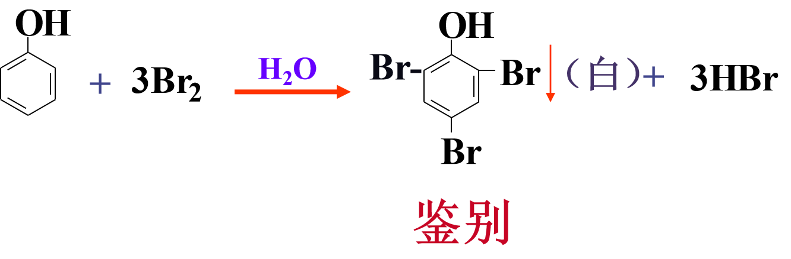
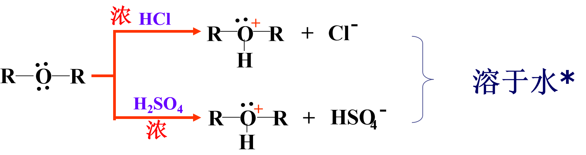
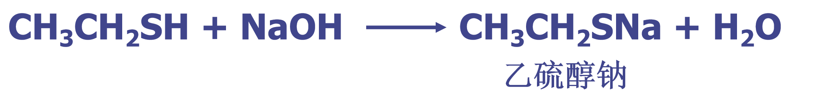

# 醇酚醚
## 目的要求
1. 掌握醇、酚、醚的结构。
2. 掌握醇、酚、醚的主要化学性质。
3. 熟悉硫醇、硫醚的结构和化学性质。
4. 了解电子理论的应用。
5. 了解硫醇、硫醚化合物的应用。
## 醇
### 命名
- 与相应不饱和烃的命名原则相同。如主链含有不饱和键，从靠近不饱和键一端开始编号
-  -OH 连接在不饱和碳上
  
-  一个碳上连有多个-OH
  
- 不饱和醇----**选择含-OH和不饱和键的最长链**，**从靠近-OH一端开始编号**

### 与活泼金属反应

- 反应活性：
    - CH$_3$OH  ＞  伯醇  ＞  仲醇  ＞   叔醇

### 与氢卤酸反应
- 卤代烃水解的逆反应
- 卢卡斯试剂（Lucas）可鉴别伯仲叔醇
  - 浓HCL + 无水ZnCl$_2$

### 脱水反应
1. 分子内脱水成烯（β-H 消除反应）

   - 反应速度：叔醇   >   仲醇  >  伯醇
2. 分子间脱水成醚
    - 一般只适用于伯醇（仲醇和叔醇易发生消除反应）
    - 亲核取代反应
  

### 酯的生成

### 氧化和脱氢（α-H 反应）
1. 伯醇氧化生成醛或羧酸

2. **沙瑞特（Sarret）试剂**可控制氧化伯醇生成醛，**若分子中含有双键或三键不受影响**。

3. 仲醇氧化生成酮

4. 叔醇不易氧化

### 二元醇的反应
#### 与高碘酸（HIO4）反应

使用范围：**相邻碳原子上有-OH**,  可鉴别**邻二醇**。

#### 与 Cu(OH)$_2$反应

## 酚
### 命名
- 芳环上还连有卤素、烃基、硝基时， 酚为母体，其它取代基的名称则写在芳环之前
- **羧基磺酸**优先为母体
- O原子为SP2 不等性杂化

### 酚羟基的反应
1. 酸性： 大大强于醇

    - 芳环上连接吸电子基 —— 酸性↑
    - 芳环上连接给电子基 —— 酸性↓
2. 与三氯化铁的反应

    - 不同的酚所产生的颜色不相同：
    
    - FeCl3与烯醇结构显色
3. 酚醚的形成
由于p-π共轭效应使得酚分子中的C-O键比较牢固（即双键化了），难以通过分子间脱水来制备酚醚。（高温或催化剂）

酚钠与卤代烃的反应( Williamson合成)

### 苯环上亲电取代反应
1. 卤代

2. 硝化

    - 可以用水蒸气蒸馏方法进行分离
      - 对硝基苯酚则只能在分子间形成氢键
      - 邻硝基苯酚可以在分子内形成氢键
3. 磺化

### 氧化反应

- 二元酚和多元酚比苯酚更容易被氧化
- 利用酚的易氧化性，邻苯二酚与对苯二酚常用作照相底片的显影剂，将氧化银还原成金属银。

## 醚
### 命名
- 先写出二个烃基的名称，再加上“醚”字
- RO-  —— 烷氧基
- 环状醚命名常采用俗名，没有俗名的称为氧杂某烷
- 冠醚 crown ethers用x—冠—y命名，x—环上总原子数，y—环上总氧原子数

### 鎓盐的形成
鎓盐是一种弱碱强酸盐，仅在浓酸中才稳定，利用此性质可将醚从烷烃或卤代烃中分离出来。

### 醚键的断裂
醚和**浓氢碘酸**（或**氢溴酸**）作用时，则醚键发生断裂

- 小基团生成卤代烃
- 大基团生成醇或酚
- $I^-$进攻空间位阻较小的基团，属于$S_N2$历程

- 两个烃基都是芳基的醚，其醚键非常稳定，不易断裂。如二苯醚，可作为载热体。

### 过氧化物的形成

- 醚对氧化剂是稳定的，但在空气中久置，会慢慢发生自动氧化，生成过氧化物
- 过氧化物是不稳定的化合物，在加热或蒸馏的过程中很容易分解而发生猛烈的爆炸
- 检验过氧化物的方法
    - 碘化钾淀粉试纸 （变蓝）
    - 过氧化物  + Fe²⁺ → Fe³⁺ → SCN⁻ → [Fe(SCN)]²⁺(血红色)

## 环氧化合物
三元环状醚称作环氧化合物
### 命名

### 开环反应
1. 酸性条件下与H$_2$O、ROH、HX等活泼氢化合

2. 碱性条件下与NaOH、RONa、ArONa、NH3等强亲核试剂反应

    - 开环反应按SN2历程进行
  

3. 与格氏试剂作用

## 硫醇（thiols）和硫醚（sulfides）
### 命名

### 弱酸性
特点：半径大；S—H键长；酸性比醇强

### 与重金属作用

### 氧化反应
