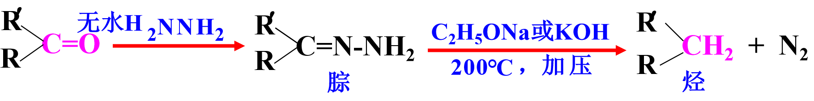

# 醛酮
## 命名
- 醛为1
- 酮从靠近羰基的一端开始编号

## 羰基的亲核加成反应
### 与氢氰酸加成

- 增长碳链
- 氰基水解成酸，制α-羟基酸
- 双面进攻一般得到外消旋体
- 应用范围：醛、甲基脂肪酮、C8以下环酮
- 影响醛酮亲核加成反应活性的因素：
    - 羰基碳的电正性
    - 羰基侧链的空间位阻

### 与亚硫酸氢钠加成

- 分离、提纯
- 晶体可鉴别
- 应用范围：醛、甲基脂肪酮、C8以下环酮
- α-羟基磺酸钠可用来制备α-羟基腈

### 与水加成

### 与醇加成

- 葡萄糖涉及缩醛
- 保护醛基
- 缩醛（酮）对碱、氧化剂、还原剂等稳定。在**稀酸**溶液中，室温下可水解，生成原来的醛（酮）和醇

- 分子内也能形成半缩醛、缩醛

- 酮与醇的反应很慢，生成缩酮比较困难。需要用二元醇反应可以顺利制得缩酮。

- 缩醛、缩酮反应的应用：羰基的保护

### 与氨的衍生物加成

- 特点：
  - 先亲核加成，后失水
  - 保留双键
  - 晶体
- 意义：
  - 晶体可测熔点
  - 鉴别

黄色固体，并有一定的熔点，故可鉴别醛酮

### 希夫试剂
- 品红亚硫酸试剂
  - 二氧化硫+水

- 甲醛 (+)  紫红色 * 加浓 H2SO4 不褪色
- 其它醛 (+)  紫红色
- 酮   (-)

### 与格氏试剂加成

## α-活泼H的反应
醛酮的α-H 解离生成的相应碳负离子，能够通过电子离域作用而得到稳定

### 卤仿反应（碘仿反应）

- 鉴别具有三个α-H的醛和酮
- 将醇氧化成相应的醛或酮

### 羟醛缩合
在稀碱的作用下含α-H的醛酮，发生缩合生成β-羟基醛或酮，称为羟醛缩合反应。

- 醛易发生羟醛缩合反应，两个不同的醛可以发生交叉缩合反应
- 酮的反应较难进行（空间位阻）。没有α-H 的醛和有α-H 的酮交叉羟醛缩合反应

## 氧化反应
1. 强氧化剂，如酸性高锰酸钾-加热，则生成苯甲酸

2. 酮难氧化,直链酮在强氧化作用下生成几种小分子羧酸混合物；环己酮在强氧化作用下生成己二酸

### 托伦(Tollens)试剂

反应范围：只氧化醛，不氧化酮，C=C、C≡C也 不被氧化。

### 斐林试剂(Fehling)
碱性氢氧化铜溶液（A液：CuSO4；B液：NaOH+酒石酸钠钾）

反应范围：芳香醛、酮不反应，C=C、C≡C也 不被氧化。  
本尼迪特试剂：硫酸铜与碳酸钠和柠檬酸钠的混合溶液

### 三种氧化剂的氧化性比较
|          | 脂肪醛 | 芳香醛 |  酮   |
| -------- | :----: | :----: | :---: |
| 托伦试剂 |  (+)   |  (+)   |  (-)  |
| 斐林试剂 |  (+)   |  (-)   |  (-)  |
| 本尼迪特 |  (+)   |  (-)   |   (-)  |

## 还原反应

### 还原成醇
#### 催化还原

#### 用金属氢化物还原
- 还原具有选择性

- 反应在绝对无水条件下进行
- LiAlH4 还可以还原： －COOH ， －COOR ， －CN ， －NO2 等
- NaBH4可在水或醇/水介质中
- 还原能力不如LiAlH4

### 还原成烃
#### 克里门森(Clemmensen)还原法
- 醛酮在锌汞齐和浓盐酸作用下，可被还原为烃，羰基变为亚甲基
- 酸性条件下将C=O还原成CH2

#### kishner—wolff反应和黄鸣龙改进法
- 碱性条件下将C=O还原成CH2

- 改进后优点
  - 反应可在常压进行
  - 反应时间大为缩短（由50\~100h缩短为3\~5h）
  - 可以用肼的水溶液，成本降低

### 坎尼扎罗（ Cannizzaro ）反应

- 自身氧化还原反应
- 两种没有α-H的醛发生交叉坎尼扎罗反应
- 若其中一个是甲醛，则甲醛总是被氧化为甲酸（盐）

# 醌
## 结构与命名
α, β－不饱和二酮

## 烯键亲电加成反应

## 羰基亲核加成反应

## 醌的 1 ， 4 －加成
- 与氢卤酸

- 与氢氰酸
